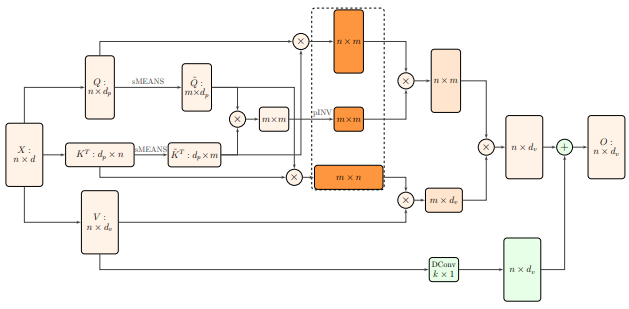

</img>

## Nyström Attention

Implementation of Nyström Self-attention, from the paper <a href="https://arxiv.org/abs/2102.03902">Nyströmformer</a>.

<a href="https://www.youtube.com/watch?v=m-zrcmRd7E4">Yannic Kilcher video</a>

## Install

```bash
$ pip install nystrom-attention
```

## Usage

```python
import torch
from nystrom_attention import NystromAttention

attn = NystromAttention(
    dim = 512,
    dim_head = 64,
    heads = 8,
    num_landmarks = 256,    # number of landmarks
    pinv_iterations = 6,    # number of moore-penrose iterations for approximating pinverse. 6 was recommended by the paper
    residual = True         # whether to do an extra residual with the value or not. supposedly faster convergence if turned on
)

x = torch.randn(1, 16384, 512)
mask = torch.ones(1, 16384).bool()

attn(x, mask = mask) # (1, 16384, 512)
```

Nyströmformer, layers of Nyström attention

```python
import torch
from nystrom_attention import Nystromformer

model = Nystromformer(
    dim = 512,
    dim_head = 64,
    heads = 8,
    depth = 6,
    num_landmarks = 256,
    pinv_iterations = 6
)

x = torch.randn(1, 16384, 512)
mask = torch.ones(1, 16384).bool()

model(x, mask = mask) # (1, 16384, 512)
```

You can also import it as Nyströmer if you wish

```python
from nystrom_attention import Nystromer
```
## Citations

```bibtex
@misc{xiong2021nystromformer,
    title   = {Nyströmformer: A Nyström-Based Algorithm for Approximating Self-Attention},
    author  = {Yunyang Xiong and Zhanpeng Zeng and Rudrasis Chakraborty and Mingxing Tan and Glenn Fung and Yin Li and Vikas Singh},
    year    = {2021},
    eprint  = {2102.03902},
    archivePrefix = {arXiv},
    primaryClass = {cs.CL}
}
```
